### Escuela Colombiana de Ingeniería
### Arquitecturas de Software - ARSW-Laboratorio-8

### Integrantes
Guillermo Esteban Bernal Bonilla
Edwin Yesid Rodriguez Maldonado

## Escalamiento en Azure con Maquinas Virtuales, Sacale Sets y Service Plans

### Dependencias
* Cree una cuenta gratuita dentro de Azure. Para hacerlo puede guiarse de esta [documentación](https://azure.microsoft.com/en-us/free/search/?&ef_id=Cj0KCQiA2ITuBRDkARIsAMK9Q7MuvuTqIfK15LWfaM7bLL_QsBbC5XhJJezUbcfx-qAnfPjH568chTMaAkAsEALw_wcB:G:s&OCID=AID2000068_SEM_alOkB9ZE&MarinID=alOkB9ZE_368060503322_%2Bazure_b_c__79187603991_kwd-23159435208&lnkd=Google_Azure_Brand&dclid=CjgKEAiA2ITuBRDchty8lqPlzS4SJAC3x4k1mAxU7XNhWdOSESfffUnMNjLWcAIuikQnj3C4U8xRG_D_BwE). Al hacerlo usted contará con $200 USD para gastar durante 1 mes.

### Parte 0 - Entendiendo el escenario de calidad

Adjunto a este laboratorio usted podrá encontrar una aplicación totalmente desarrollada que tiene como objetivo calcular el enésimo valor de la secuencia de Fibonnaci.

**Escalabilidad**
Cuando un conjunto de usuarios consulta un enésimo número (superior a 1000000) de la secuencia de Fibonacci de forma concurrente y el sistema se encuentra bajo condiciones normales de operación, todas las peticiones deben ser respondidas y el consumo de CPU del sistema no puede superar el 70%.

### Parte 1 - Escalabilidad vertical

1. Diríjase a el [Portal de Azure](https://portal.azure.com/) y a continuación cree una maquina virtual con las características básicas descritas en la imágen 1 y que corresponden a las siguientes:
    * Resource Group = SCALABILITY_LAB
    * Virtual machine name = VERTICAL-SCALABILITY
    * Image = Ubuntu Server 
    * Size = Standard B1ls
    * Username = scalability_lab
    * SSH publi key = Su llave ssh publica

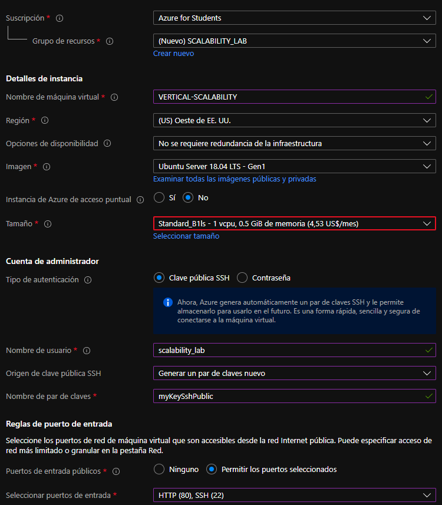

2. Para conectarse a la VM use el siguiente comando, donde las `x` las debe remplazar por la IP de su propia VM.

    `ssh scalability_lab@xxx.xxx.xxx.xxx`

3. Instale node, para ello siga la sección *Installing Node.js and npm using NVM* que encontrará en este [enlace](https://linuxize.com/post/how-to-install-node-js-on-ubuntu-18.04/).

	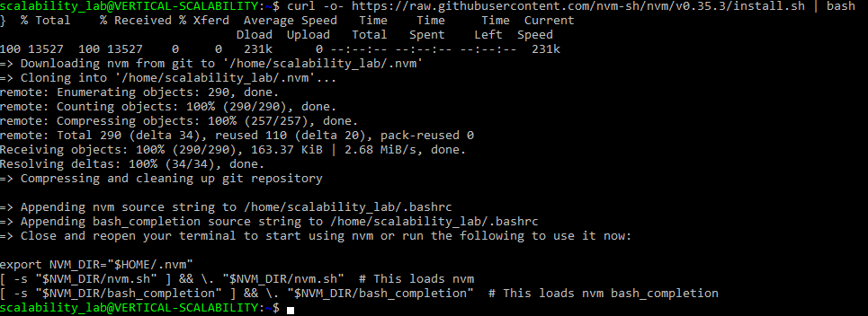
	
	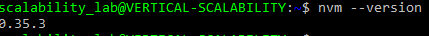
	
	Instalando Node.js and npm
	
	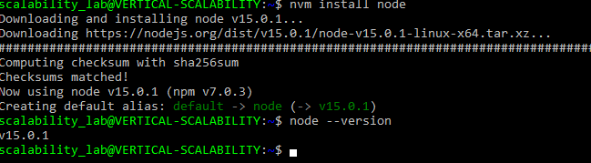
	
	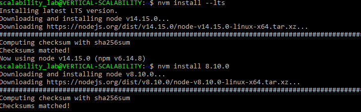
	
	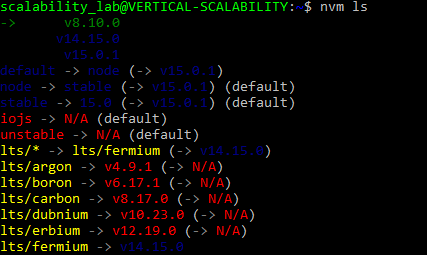
	
	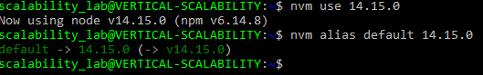

4. Para instalar la aplicación adjunta al Laboratorio, suba la carpeta `FibonacciApp` a un repositorio al cual tenga acceso y ejecute estos comandos dentro de la VM:

    `git clone <your_repo>`

    `cd <your_repo>/FibonacciApp`

    `npm install`
	
	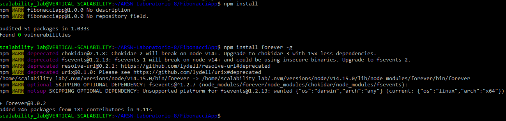
	

5. Para ejecutar la aplicación puede usar el comando `npm FibinacciApp.js`, sin embargo una vez pierda la conexión ssh la aplicación dejará de funcionar. Para evitar ese compartamiento usaremos *forever*. Ejecute los siguientes comando dentro de la VM.

    `npm install forever -g`

    `forever start FibinacciApp.js`
	
	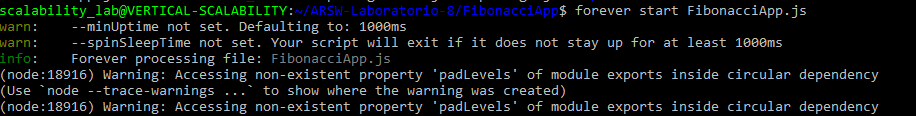

6. Antes de verificar si el endpoint funciona, en Azure vaya a la sección de *Networking* y cree una *Inbound port rule* tal como se muestra en la imágen. Para verificar que la aplicación funciona, use un browser y user el endpoint `http://xxx.xxx.xxx.xxx:3000/fibonacci/6`. La respuesta debe ser `The answer is 8`.

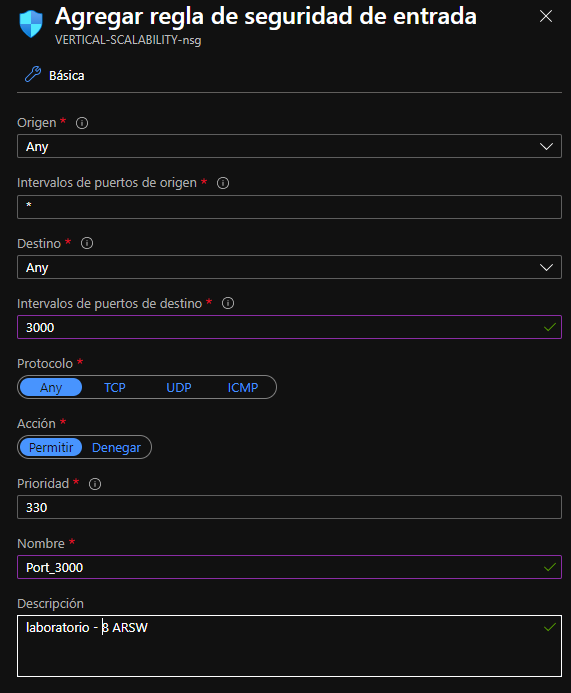

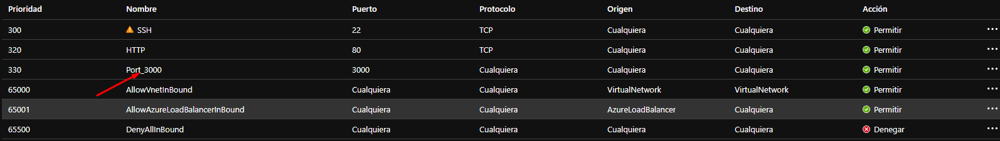

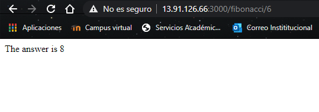

7. La función que calcula en enésimo número de la secuencia de Fibonacci está muy mal construido y consume bastante CPU para obtener la respuesta. Usando la consola del Browser documente los tiempos de respuesta para dicho endpoint usando los siguintes valores:
    * 1000000
	
	
	
    * 1010000
	
	
	
    * 1020000
	
	
	
    * 1030000
	
	
	
    * 1040000
	
	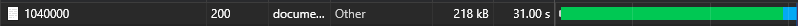
	
    * 1050000
	
	
	
    * 1060000
	
	
	
    * 1070000
	
	
	
    * 1080000
	
	
	
    * 1090000    
	
	

8. Dírijase ahora a Azure y verifique el consumo de CPU para la VM. (Los resultados pueden tardar 5 minutos en aparecer).

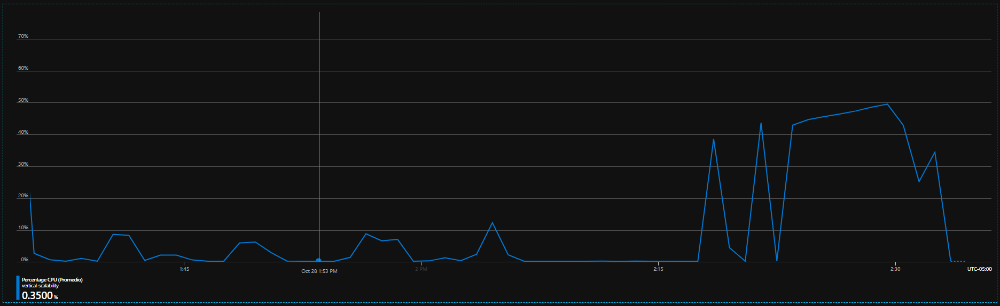

9. Ahora usaremos Postman para simular una carga concurrente a nuestro sistema. Siga estos pasos.
    * Instale newman con el comando `npm install newman -g`. Para conocer más de Newman consulte el siguiente [enlace](https://learning.getpostman.com/docs/postman/collection-runs/command-line-integration-with-newman/).
	
	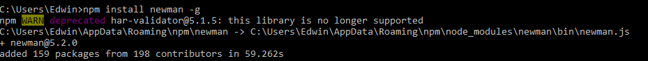
	
    * Diríjase hasta la ruta `FibonacciApp/postman` en una maquina diferente a la VM.
    * Para el archivo `[ARSW_LOAD-BALANCING_AZURE].postman_environment.json` cambie el valor del parámetro `VM1` para que coincida con la IP de su VM.
    * Ejecute el siguiente comando.

    ```
    newman run ARSW_LOAD-BALANCING_AZURE.postman_collection.json -e [ARSW_LOAD-BALANCING_AZURE].postman_environment.json -n 10 &
    newman run ARSW_LOAD-BALANCING_AZURE.postman_collection.json -e [ARSW_LOAD-BALANCING_AZURE].postman_environment.json -n 10
    ```
	
	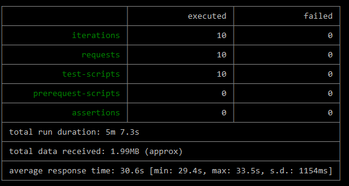
	
	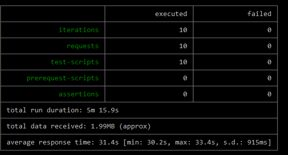
	
10. La cantidad de CPU consumida es bastante grande y un conjunto considerable de peticiones concurrentes pueden hacer fallar nuestro servicio. Para solucionarlo usaremos una estrategia de Escalamiento Vertical. En Azure diríjase a la sección *size* y a continuación seleccione el tamaño `B2ms`.

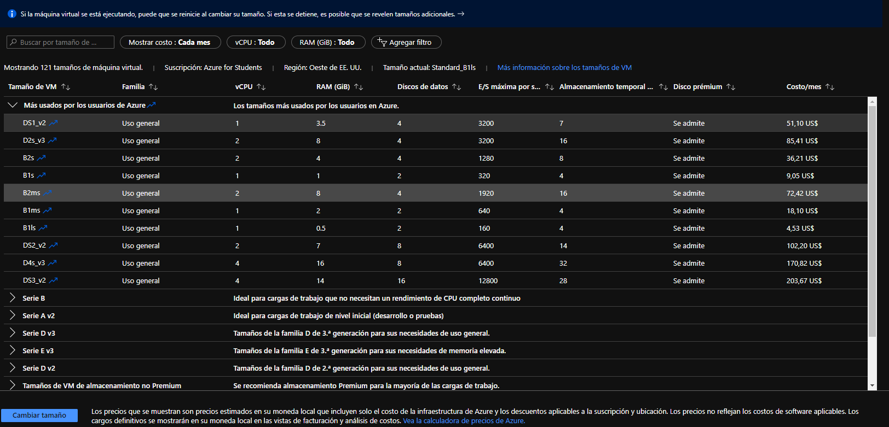

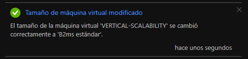

11. Una vez el cambio se vea reflejado, repita el paso 7, 8 y 9.

	* 1000000
	
	
	
    * 1010000
	
	
	
    * 1020000
	
	
	
    * 1030000
	
	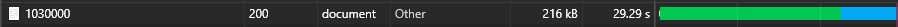
	
    * 1040000
	
	
	
    * 1050000
	
	
	
    * 1060000
	
	
	
    * 1070000
	
	
	
    * 1080000
	
	
	
    * 1090000    
	
	
	
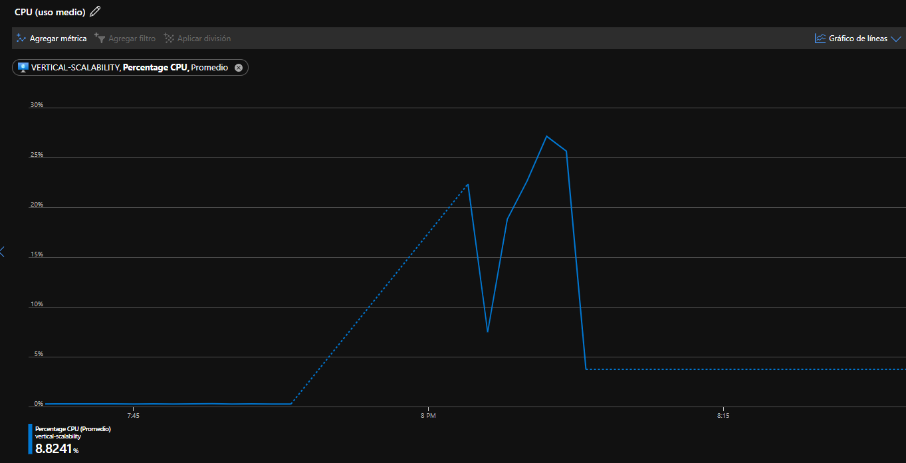

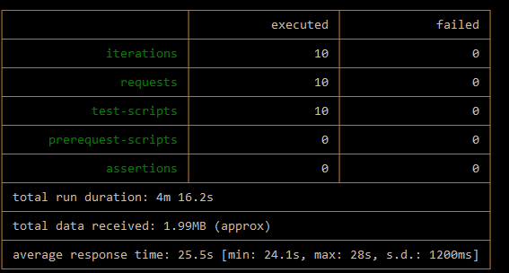

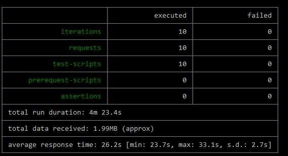

12. Evalue el escenario de calidad asociado al requerimiento no funcional de escalabilidad y concluya si usando este modelo de escalabilidad logramos cumplirlo.
13. Vuelva a dejar la VM en el tamaño inicial para evitar cobros adicionales.

**Preguntas**

1. ¿Cuántos y cuáles recursos crea Azure junto con la VM?

	Son 6 recursos: 
	- Red virtual
	- Cuenta de almacenamiento
	- Dirección IP pública
	- Grupo de seguridad de red
	- La intefaz de red
	- Disco
	
2. ¿Brevemente describa para qué sirve cada recurso?

	- Red virtual: Permiten la comunicación entre recursos de Azure que opera en su propio centro de datos, tiene ciertos beneficios tales como disponibilidad, escalabilidad y aislamiento.
	- Cuenta de almacenamiento: Un centro con todos los datos de Azure Storage, cuenta con un espacio de nombres único al que se puede acceder desde cualquier parte del mundo a traves de HTTP o HTTPS.
	- Dirección IP pública: Permiten la comunicación entre los recursos de Azure mediante Internet asi como con los servicios publicos de Azure, esta asociada a interfaces de red, balanceadores de carga, pasarelas y cortafuegos.
	- Grupo de seguridad de red: Se encarga de filtrar el trafico de red desde y hacia los recursos de una red virtual.
	- La intefaz de red: Permite que una maquina virtual Azure se comunique con internet y con los recursos locales de la maquina. 
	- Disco: Es el almacenamiento que posee la maquina virtual.
	
3. ¿Al cerrar la conexión ssh con la VM, por qué se cae la aplicación que ejecutamos con el comando `npm FibonacciApp.js`? ¿Por qué debemos crear un *Inbound port rule* antes de acceder al servicio?

RTA: La aplicación se cae ya que todos los procesos iniciados se veran afectados y terminados al cerrar la conexión SSH, por esta razón se hace una regla de entrada en el puerto 3000 que lo que hará es poner el servicio en Internet.

4. Adjunte tabla de tiempos e interprete por qué la función tarda tanto tiempo.


Una mal implementación hace que la aplicación ejecute procesos innecesarios de forma iterativa que ya han sido realizados en vez de guardarlos en memoria.

5. Adjunte imágen del consumo de CPU de la VM e interprete por qué la función consume esa cantidad de CPU.


6. Adjunte la imagen del resumen de la ejecución de Postman. Interprete:
    **B1ls**
    
    
    
    

    * Tiempos de ejecución de cada petición: 30.6s y 31.4s
    * Si hubo fallos documentelos y explique: no se evidencian fallos
    
7. ¿Cuál es la diferencia entre los tamaños `B2ms` y `B1ls` (no solo busque especificaciones de infraestructura)?


8. ¿Aumentar el tamaño de la VM es una buena solución en este escenario?, ¿Qué pasa con la FibonacciApp cuando cambiamos el tamaño de la VM?

RTA: No es una buena opción ya que si se evidencia un cambio en los tiempos de ejecución pero muy leves, el consumo de CPU tambien disminuye pero no es significativo, por otro lado, al cambiar el tamaño se pierde disponibilidad en la aplicación ya que se debe reiniciar la aplicación para que funcione con el nuevo tamaño.

9. ¿Qué pasa con la infraestructura cuando cambia el tamaño de la VM? ¿Qué efectos negativos implica?

RTA: Tiene bastantes efectos negativos ya que al cambiar el tamaño de la VM la aplicación debe reinciarse y dejara de funcionar durante un tiempo, ese tiempo significan perdidas economicas, perdidas de peticiones en las que pueden estar datos de mucha importancia, etc.

10. ¿Hubo mejora en el consumo de CPU o en los tiempos de respuesta? Si/No ¿Por qué?

RTA: En el consumo de CPU si hubo un cambio considerable de un 35% a un 8.8%, en cuanto a los tiempos de ejecución no varian mucho gracias a la mala implementación de la aplicación.

11. Aumente la cantidad de ejecuciones paralelas del comando de postman a `4`. ¿El comportamiento del sistema es porcentualmente mejor?

RTA: No mejoro el comportamiento del sistema, aunque no se evidencian fallos el tiempo de respuesta sigue sin mejorar por la mala implemtación.

### Parte 2 - Escalabilidad horizontal

#### Crear el Balanceador de Carga

Antes de continuar puede eliminar el grupo de recursos anterior para evitar gastos adicionales y realizar la actividad en un grupo de recursos totalmente limpio.

1. El Balanceador de Carga es un recurso fundamental para habilitar la escalabilidad horizontal de nuestro sistema, por eso en este paso cree un balanceador de carga dentro de Azure tal cual como se muestra en la imágen adjunta.


2. A continuación cree un *Backend Pool*, guiese con la siguiente imágen.


3. A continuación cree un *Health Probe*, guiese con la siguiente imágen.


4. A continuación cree un *Load Balancing Rule*, guiese con la siguiente imágen.


5. Cree una *Virtual Network* dentro del grupo de recursos, guiese con la siguiente imágen.


#### Crear las maquinas virtuales (Nodos)

Ahora vamos a crear 3 VMs (VM1, VM2 y VM3) con direcciones IP públicas standar en 3 diferentes zonas de disponibilidad. Después las agregaremos al balanceador de carga.

1. En la configuración básica de la VM guíese por la siguiente imágen. Es importante que se fije en la "Avaiability Zone", donde la VM1 será 1, la VM2 será 2 y la VM3 será 3.


2. En la configuración de networking, verifique que se ha seleccionado la *Virtual Network*  y la *Subnet* creadas anteriormente. Adicionalmente asigne una IP pública y no olvide habilitar la redundancia de zona.


3. Para el Network Security Group seleccione "avanzado" y realice la siguiente configuración. No olvide crear un *Inbound Rule*, en el cual habilite el tráfico por el puerto 3000. Cuando cree la VM2 y la VM3, no necesita volver a crear el *Network Security Group*, sino que puede seleccionar el anteriormente creado.


4. Ahora asignaremos esta VM a nuestro balanceador de carga, para ello siga la configuración de la siguiente imágen.


5. Finalmente debemos instalar la aplicación de Fibonacci en la VM. para ello puede ejecutar el conjunto de los siguientes comandos, cambiando el nombre de la VM por el correcto

```
git clone https://github.com/daprieto1/ARSW_LOAD-BALANCING_AZURE.git

curl -o- https://raw.githubusercontent.com/creationix/nvm/v0.34.0/install.sh | bash
source /home/vm1/.bashrc
nvm install node

cd ARSW_LOAD-BALANCING_AZURE/FibonacciApp
npm install

npm install forever -g
forever start FibonacciApp.js
```

Realice este proceso para las 3 VMs, por ahora lo haremos a mano una por una, sin embargo es importante que usted sepa que existen herramientas para aumatizar este proceso, entre ellas encontramos Azure Resource Manager, OsDisk Images, Terraform con Vagrant y Paker, Puppet, Ansible entre otras.

#### Probar el resultado final de nuestra infraestructura

1. Porsupuesto el endpoint de acceso a nuestro sistema será la IP pública del balanceador de carga, primero verifiquemos que los servicios básicos están funcionando, consuma los siguientes recursos:

http://52.155.223.248/

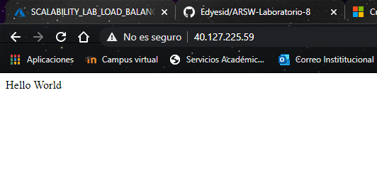

http://52.155.223.248/fibonacci/1

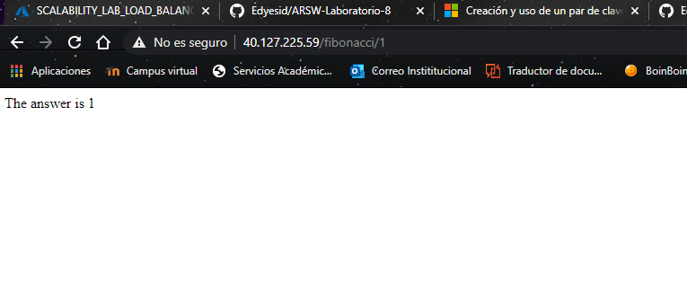

2. Realice las pruebas de carga con `newman` que se realizaron en la parte 1 y haga un informe comparativo donde contraste: tiempos de respuesta, cantidad de peticiones respondidas con éxito, costos de las 2 infraestrucruras, es decir, la que desarrollamos con balanceo de carga horizontal y la que se hizo con una maquina virtual escalada.

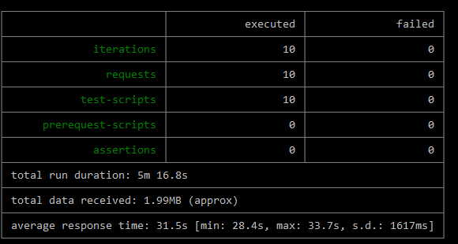

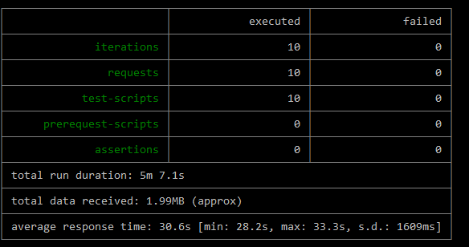

3. Agregue una 4 maquina virtual y realice las pruebas de newman, pero esta vez no lance 2 peticiones en paralelo, sino que incrementelo a 4. Haga un informe donde presente el comportamiento de la CPU de las 4 VM y explique porque la tasa de éxito de las peticiones aumento con este estilo de escalabilidad.

```
newman run ARSW_LOAD-BALANCING_AZURE.postman_collection.json -e [ARSW_LOAD-BALANCING_AZURE].postman_environment.json -n 10 &
newman run ARSW_LOAD-BALANCING_AZURE.postman_collection.json -e [ARSW_LOAD-BALANCING_AZURE].postman_environment.json -n 10 &
newman run ARSW_LOAD-BALANCING_AZURE.postman_collection.json -e [ARSW_LOAD-BALANCING_AZURE].postman_environment.json -n 10 &
newman run ARSW_LOAD-BALANCING_AZURE.postman_collection.json -e [ARSW_LOAD-BALANCING_AZURE].postman_environment.json -n 10
```
**COMPARACIÓN**

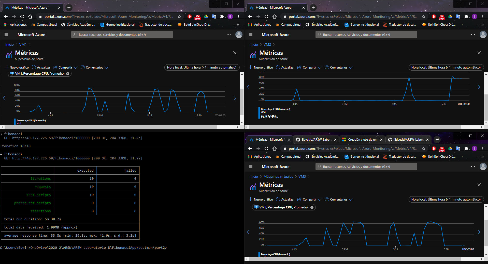

MV1

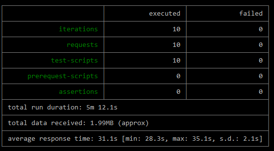

MV2

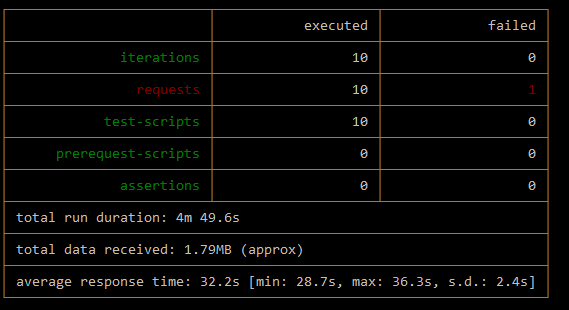

MV3

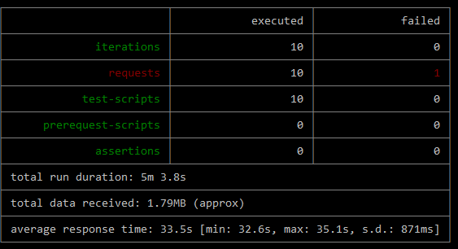

MV4

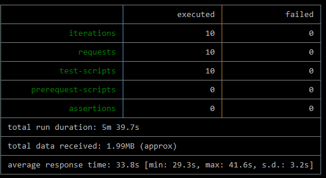

**Preguntas**

* ¿Cuáles son los tipos de balanceadores de carga en Azure y en qué se diferencian?, ¿Qué es SKU, qué tipos hay y en qué se diferencian?, ¿Por qué el balanceador de carga necesita una IP pública?
	- Balanceadores de carga(Publico): Es utilizado para equilibrar la carga del trafico de internet en las maquinas virtuales, esto es realizado mediante una traducción de sus direcciones IP privadas a direcciones IP públicas
	- Balanceadores de carga(Privado): Es utilizado para equilibrar la carga del tráfico dentro de una red privada, solo utilizan ips privadas en la interfaz.
	- SKU: Representa una unidad de mantenimiento de existencias que se puede comprar debajo de un producto. Estos representan las diferentes formas del producto.
		* Estandar
		* Ensamblaje
		* Paquete
		* Virtual
		* Componente
		* Colección
	
* ¿Cuál es el propósito del *Backend Pool*?

RTA: Es un componente del balaneador de carga que define el grupo de recursos que brindarán tráfico para una Load Balancing Rule determinada

* ¿Cuál es el propósito del *Health Probe*?

RTA: Su proposito es usar el balanceador de carga para determinar si las instancias dentro del Backend Pool están en buen estado.

* ¿Cuál es el propósito de la *Load Balancing Rule*? ¿Qué tipos de sesión persistente existen, por qué esto es importante y cómo puede afectar la escalabilidad del sistema?.

RTA: Se usa para definir la manera de distibuir el tráfico entrante a todas las instancias dentro del Backend Pool, existen  tipos:
	- None
	- Client IP

* ¿Qué es una *Virtual Network*? ¿Qué es una *Subnet*? ¿Para qué sirven los *address space* y *address range*?

RTA:
	- *Virtual Network*: Es una tecnología de red que permite extender la red de área local sobre una red pública, permite que muchos tipos de recursos de Azure, como Azure Virtual Machines (VM), se comuniquen de forma segura entre sí, con Internet y con las redes locales.
	- *Subnet*: Es una division que se hace a la red virtual a la cual le permitira la asignación de una o varias subredes cad una con un grupo de diorecciones de propia elección
	- *address space*: El espacio de direcciones puede referirse a un rango de direcciones físicas o virtuales accesibles a un procesador o reservadas para un proceso.
	- *address range*: Las direcciones IP se pueden clasificar en cinco clases A, B, C, D y E. Cada clase consta de un subconjunto contiguo del rango general de direcciones IPv4.

* ¿Qué son las *Availability Zone* y por qué seleccionamos 3 diferentes zonas?. ¿Qué significa que una IP sea *zone-redundant*?

RTA:
	- *Availability Zone*: Son Ubicaciones geográficas únicas dentro de una región, cada zona de disponibilidad se compone de uno o más centros de datos y alberga infraestructura para admitir aplicaciones de misión crítica de alta disponibilidad. En este caso se escogieron 3 para asegurar una alta disponibilidad ya que en caso de que alguna de las 3 zonas llegue a presentar problemas las otras dos seguiran con su funcionamiento sin complicaciones.
	- *zone-redundant*: Separa física y lógicamente el gateway dentro de una region,para aplicaciones donde se requiere acceso de lectura y escritura de alta disponibilidad en una región de Azure

* ¿Cuál es el propósito del *Network Security Group*?

RTA:  Se encarga de filtrar el trafico de red desde y hacia los recursos de una red virtual.

* Informe de newman 1 (Punto 2)

**B1ls**


Tiempo promedio: 31.5s, peticiones aceptadas: 10

**B2ms**


Tiempo promedio: 30.6s, peticiones aceptadas: 10

Aunque el tiempo promedio no muestra un cambio significativo, el escalmiento vertical puede presentar más fallos que el escalamiento vertical, esto tmabien se puede evidenciar al realizar los calculos de costos por mes.

* Presente el Diagrama de Despliegue de la solución.


